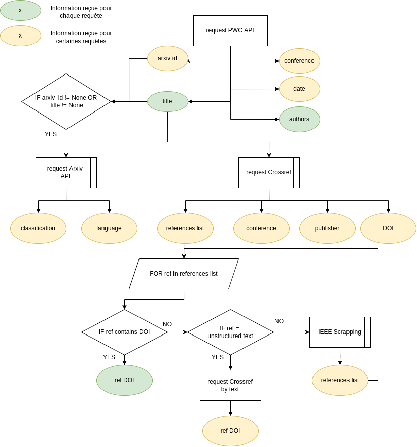

# Projet Neo4J : Visualisation de métadonnées de publications scientifiques

# 1. Introduction
&emsp;&emsp;Dans le cadre de notre projet neo4j, nous construisons une base de données graphe à partir des metadonnées de publications scientifiques hébergées sur le site https://paperswithcode.com. Des informations supplémentaires sur ces publications sont également récupérées sur d'autres sites via des API et du scraping.

Le but est ensuite de requêter cette base pour répondre à des questions sur le dataset, telles que:
- Quels sont les papiers les plus référencés?
- Quels sont les mots-clés les plus cités?
- Quels sont les auteurs à l'origine du plus grand nombre de publications?
- ...

## Les Données

La base de donnée a été construite à partir de données issues de plusieurs sources. Le point de départ est la plateforme [Papers With Code](https://paperswithcode.com/), via son API publique. Les papiers retenus seront ensuite recherchés sur la plateforme [Crossref)](https://www.crossref.org/), à partir de son API publique, afin de compléter les informations. Le site [Arxiv](https://arxiv.org/) possède un système de classification de thématiques scientifiques, cette information est récoltée via leur API. 

D'autre part, dans le cadre d'une base de donnée orientée graphe, les références entre publications scienfiques sont une donnée de grande importance. Les citations sont collectées via l'[api Crossref](https://api.crossref.org/swagger-ui/index.html#/), mais quand l'information n'est pas disponible, le programme tente de la récupérer en scrappant le site d'une des principales revues scientifique : [IEEE](https://ieeexplore.ieee.org/Xplore/home.jsp).

Comme la collecte de données se fait via des requètes HTTP, un soin particulier a été apporté lors de l'implémentation, via l'usage de l'asynchronisme ([asyncio](https://docs.python.org/fr/3/library/asyncio.html)), mais surtout par la création d'un algorithme cherchant à obtenir le plus d'information possibles en limitant le nombre de requêtes.

Pour un papier ayant **r** références, **r + 5** requêtes suffisent, dans le pire des cas, à obtenir les informations générales du papier, la liste des identifiants de ses références, les informations générales de chaque références, et l'indentifiant des références des références (si obtenue en une seule requête). 
L'api de Papers With Code renvoie les métadonnées de publications par blocs de **l** papiers, ainsi, un bloc est traité en environ **l * ( r + 5 )** requêtes, ce qui correspond à une compléxité linéaire en terme de requêtes. L'implémentation fixe une valeur maximale **r = 50**

Ci-dessous se trouve un schéma résumant l'algorithme.

NB : Le DOI est un identifiant unique associé à une publication scientifique.



### Les métadonnées collectées sont les suivantes :
- le titre
- les auteurs
    - le nom
    - l'organisation d'appartenance (université, entreprise etc.)
- la date de publication
- la catégorie arxiv
- la conférence à laquelle le papier a été présenté
    - nom de la conférence
    - lieu de la conférence
    - date
- langue du papier
- liste des mots clés
- DOI
- liste des références
    - DOI de chaque référence
    
    
### Ces métadonnées sont regroupées sous le format JSON, un exemple :
```json
{
    "url_doi": "http://dx.doi.org/10.1016/j.patcog.2021.108439",
    "title": "3D pose estimation and future motion prediction from 2D images",
    "authors": [
        {
            "name": "Ji Yang",
            "organisation": []
        },
        {
            "name": "Li Cheng",
            "organisation": []
        }
    ],
    "date": "2021-11-26",
    "arxiv_category": "cs.CV",
    "conference": {
        "name": "CVPR",
        "location": "NaN",
        "date": "NaN"
    },
    "language": "NaN",
    "publisher": "Elsevier BV",
    "key_words": [
        "Artificial Intelligence",
        "Computer Vision and Pattern Recognition",
        "Signal Processing",
        "Software"
    ],
    "references": [
        "10.1007/978-3-030-01267-0_24",
        "10.1016/j.patcog.2019.05.026",
        "10.1109/cvpr.2017.644",
        "10.1109/cvpr46437.2021.01584",
        "10.1109/cvpr.2018.00551"
    ],
    "doi": "10.1016/j.patcog.2021.108439"
}
```

### Résultat de l'acquisition :

Au total, plus de 18 000 publications et 300 000 références ont été récoltés, en faisant tourner le script environ 5 heures. La vitesse dépend en grande partie de la disponibilité de l'API de Crossref, qui est fortement solicitée.


